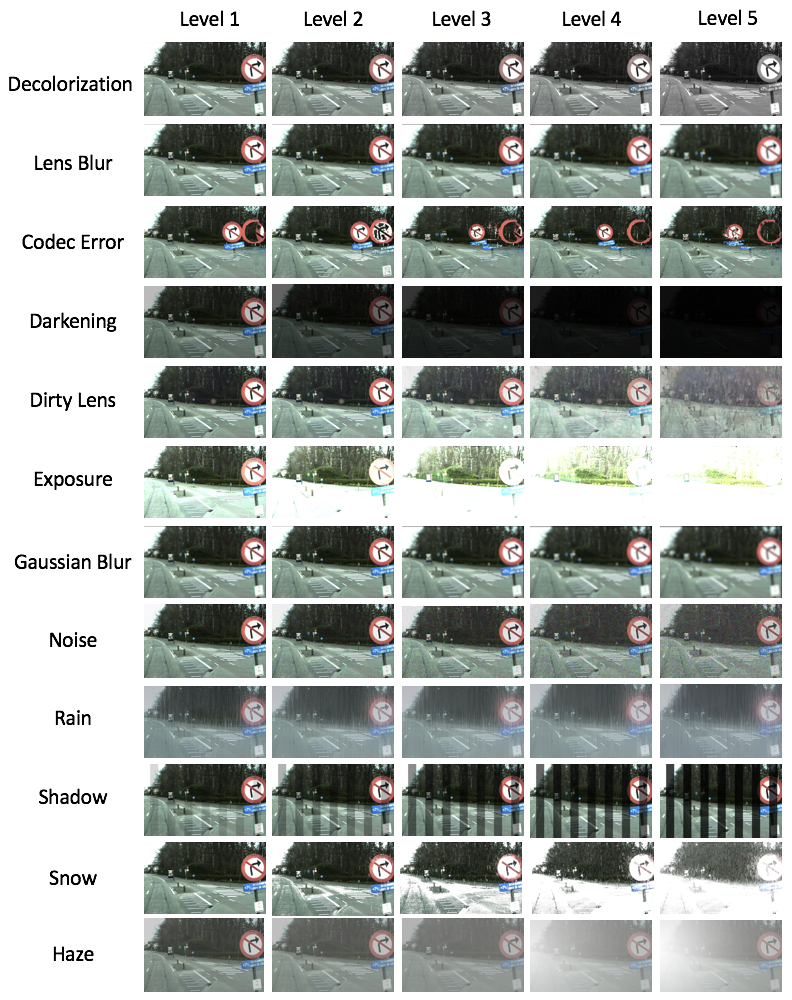
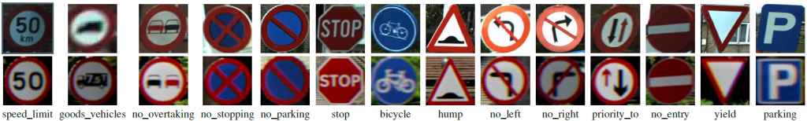
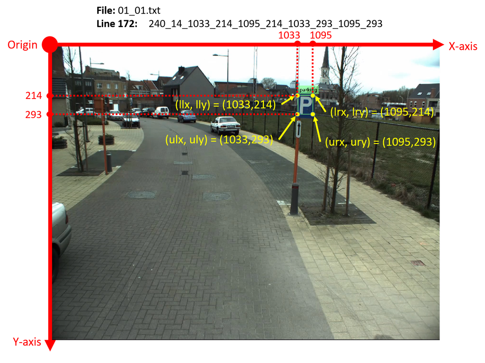

# CURE-TSD
CURE-TSD: Challenging Unreal and Real Environments for Traffic Sign Detection

 [OLIVES Lab, Georgia Institute of Technology](https://ghassanalregib.info/)


| <a href="http://www.youtube.com/watch?feature=player_embedded&v=8V1LcpDlmjA
" target="_blank"></a>
|
<a href="http://www.youtube.com/watch?feature=player_embedded&v=bKnlJ_EWS8Q
" target="_blank"></a>
|


### Publications
If you use CURE-TSD dataset or codes, please cite the papers listed below:

[Traffic Sign Detection Under Challenging Conditions: A Deeper Look into Performance Variations and Spectral Characteristics
](https://arxiv.org/abs/1908.11262)

```
@ARTICLE{temel2019traffic,
author={D. Temel and M. Chen and G. AlRegib},
journal={IEEE Transactions on Intelligent Transportation Systems},
title={Traffic Sign Detection Under Challenging Conditions: A Deeper Look into Performance Variations and Spectral Characteristics},
year={2019},
volume={},
number={},
pages={1-11},
doi={10.1109/TITS.2019.2931429},
ISSN={1524-9050},
url={https://arxiv.org/abs/1908.11262}}
```

[Traffic Signs in the Wild: Highlights from the IEEE Video and Image Processing Cup 2017 Student Competition [SP Competitions]
](https://arxiv.org/abs/1810.06169)

```
@ARTICLE{Temel2018_SPM,
author={D. Temel and G. AlRegib},
journal={IEEE Sig. Proc. Mag.},
title={Traffic Signs in the Wild: Highlights from the IEEE Video and Image Processing Cup 2017 Student
Competition [SP Competitions]},
year={2018},
volume={35},
number={2},
pages={154-161},
doi={10.1109/MSP.2017.2783449},
ISSN={1053-5888},
url={https://arxiv.org/abs/1810.06169}}
```


 [Challenging Environments for Traffic Sign Detection: Reliability Assessment under Inclement Conditions](https://arxiv.org/abs/1902.06857)

```
@article{temel2019challenging,
  title={Challenging environments for traffic sign detection: Reliability assessment under inclement conditions},
  author={Temel, Dogancan and Alshawi, Tariq and Chen, Min-Hung and AlRegib, Ghassan},
  journal={arXiv preprint arXiv:1902.06857},
  year={2019},
  url={https://arxiv.org/abs/1902.06857}
}
```

 
 [CURE-TSR: Challenging unreal and real environments for traffic sign recognition](https://arxiv.org/abs/1712.02463)

```
@INPROCEEDINGS{Temel2017_NIPSW,
Author = {D. Temel and G. Kwon and M. Prabhushankar and G. AlRegib},
Title = {{CURE-TSR: Challenging unreal and real environments for traffic sign recognition}},
Year = {2017},
booktitle = {Neural Information Processing Systems (NeurIPS) Workshop on Machine Learning for Intelligent Transportation Systems},

```


### Download Dataset
The video sequences in the CURE-TSD dataset are grouped into two classes: real data and unreal data. Real data correspond to processed versions of sequences acquired from real world. Unreal data corresponds to synthesized sequences generated in a virtual environment. There are 49 real sequences and 49 unreal sequences that do not include any specific challenge. We separated the sequences into 70% and %30 splits. Therefore, we have 34 training videos and 15 test videos in both real and unreal sequences that are challenge-free. There are 300 frames in each video sequence. There are 49 challenge-free real video sequences processed with 12 different types of effects and 5 different challenge levels, which result in 2,989 (49*12*5+49) video sequences. Moreover, there are 49 synthesized video sequences processed with 11 different types of effects and 5 different challenge levels, which leads to 2,744 (49*11*5+49) video sequences. In total, there are 5,733 video sequences, which include around 1.72 million frames. To receive  the download link, please fill out this <strong><a href="https://docs.google.com/forms/d/e/1FAIpQLScF3TO-2xhMmIc-GibKb8DBnwC6knSqew68zeRWurortg1pKg/viewform">FORM</a></strong> to submit your information and agree the conditions of use. These information will be kept confidential and will not be released to anybody outside the MSL administration team.

### Challenging Conditions
<p align="center">

</p>

### Traffic Signs
<p align="center">

</p>

### File Name Format
“sequenceType_sequenceNumber_challengeSourceType_challengeType_challengeLevel.mp4”

* sequenceType:
01 – Real data
02 – Unreal data

* sequenceNumber:
A number in between [01 – 49]

* challengeSourceType:
00 – No challenge source (which means no challenge)
01 – After affect

* challengeType:
00 – No challenge
01 – Decolorization
02 – Lens blur
03 – Codec error
04 – Darkening
05 – Dirty lens
06 – Exposure
07 – Gaussian blur
08 – Noise
09 – Rain
10 – Shadow
11 – Snow
12 – Haze

* challengeLevel:
A number in between [01-05] where 01 is the least severe and 05 is the most severe challenge.

### Test Sequences
We split the video sequences into 70% training set and 30% test set. The sequence numbers corresponding to test set are given below:

[01_04_x_x_x, 01_05_x_x_x, 01_06_x_x_x, 01_07_x_x_x, 01_08_x_x_x, 01_18_x_x_x, 01_19_x_x_x, 01_21_x_x_x, 01_24_x_x_x, 01_26_x_x_x, 01_31_x_x_x, 01_38_x_x_x, 01_39_x_x_x, 01_41_x_x_x, 01_47_x_x_x, 02_02_x_x_x, 02_04_x_x_x, 02_06_x_x_x, 02_09_x_x_x, 02_12_x_x_x, 02_13_x_x_x, 02_16_x_x_x, 02_17_x_x_x, 02_18_x_x_x, 02_20_x_x_x, 02_22_x_x_x, 02_28_x_x_x, 02_31_x_x_x, 02_32_x_x_x, 02_36_x_x_x]

The videos with all other sequence numbers are in the training set.
Note that “x” above refers to the variations listed earlier.

### Coordinate System
<p align="center">

</p>

### Annotation Format
“sequenceType_sequenceNumber.txt“.

Challenge source type, challenge type, and challenge level do not affect the annotations. Therefore, the video sequences that start with the same sequence type and the sequence number have the same annotations.

* sequenceType:
01 – Real data
02 – Unreal data

* sequenceNumber:
A number in between [01 – 49]

The format of each line in the annotation file (txt) should be: “frameNumber_signType_llx_lly_lrx_lry_ulx_uly_urx_ury”.

* frameNumber:
A number in between [001-300]

* signType:
01 – speed_limit
02 – goods_vehicles
03 – no_overtaking
04 – no_stopping
05 – no_parking
06 – stop
07 – bicycle
08 – hump
09 – no_left
10 – no_right
11 – priority_to
12 – no_entry
13 – yield
14 – parking

### Challenging Condition Generation
Adobe (c) After Effects version 14.1.0.57 was utilized to emulate challenging conditions with the following configurations:

* Decolorization: Black & White Color Correction filter version 1:0. The filter settings were: Reds= 40, Yellows= 60, Greens= 40, Cyans= 60, Blues= 20, and Magentas= 80. We utilized multiple adjustment layers to compound the effect of the color correction filter and created multiple distinct levels of this challenge.
* Lens Blur: Camera Lens Blur filter version 1:0. The filter settings were: Blur radius was set to 2; 4; 6; 8; and 10 for levels 1 – 5 and Iris Shape was Hexagan, everything else was set as default.
* Codec Error: Time Displacement filter version 1:6. The filter settings were: Max Displacement Time was set to 0:1; 0:2; 0:3; 0:4; and 0:5 for levels 1 – 5, everything else was set as default.
* Darkening: Exposure filter version 1:0. The filter was set to modify the master channel Exposure parameter to be -1;-3;-5;-7; and -9 for levels 1 – 5, everything else was set as default.
* Dirty Lens: a set of dusty and smudged lens images superimposed on the video.
* Exposure: Exposure filter version 1:0. The filter was set to modify the master channel Exposure parameter to be 1, 3, 5, 7, and 9 for levels 1 – 5, everything else was set as default.
* Gaussian Blur: Gaussian Blur filter version 3:0. The filter settings were: Bluriness was 5; 10; 15; 20; and 25 for levels 1 􀀀 5, everything else was set as default. Unlike Lens Blur,  Gaussian Blur is equally distributed in all directions, which leads to less structured blurred objects.
* Sensor Noise: Noise filter version 2:6. The filter settings were: Amount of Noise parameter was set to 20; 40; 60; 70; and 71 using 5 adjustment layers that were compounded to generate levels 1 – 5, everything else was set as default.
* Rain: Rain was implemented using Gradient Ramp generator version 3:2 with colors # 0F1E2D and # 5A7492 to create a blueish hue over the video, and CC Rainfall generator from Cycore Effects HD 1.8.2 version 1:1. The setting of CC Rainfall generator were: Drops was set to 10000; 20000; 50000; and 100000 and Opacity was 25% using 5 adjustment layers that were compounded to generates levels 1 – 5, everything else was set as default.
* Shadow: Venetian Blinds filter version 2:3. The filter settings were: Transition Completeness was 47%, Direction was 0x + 0:0°, Width was 142, and Opacity was 15%; 30%; 45%; 60%, and 75% for levels 1-5, everything
else was set as default.
* Snow: Glow filter version 2:6 with color # FFFFF to create a white hue over the video, and CC Snowfall generator from Cycore Effects HD 1.8.2 version 1:1. The setting of Glow filter were: Glow Threshold was 55%, Glow Intensity was 1:4, Glow Operation was Screen, and Glow Dimension was Horizontal. The setting of CC Snowfall generator were: Drops 10000; 50000; 100000, and 140000 using 9 adjustment layers that were compounded to generates levels 1-5, everything else was set as default.
* Haze: Ellipse Shape Layer filter version 1:0 with radial gradient fill using color # D6D6D6 in the center with 100% opacity and color # 000000 with 0% opacity on the edges, Smart Blur version 1:0, Exposure version 1:0, and Brightness & contrast version 1:0. The shape and focal point location of the Ellipse was manually controlled to closely follow the furthest point in the video, which created a sense of depth to the scene and emulated the behaviour of haze in realistic settings. The setting of Smart Blur filter were: Radius was 3, and Threshold was 25. The setting of Exposure filter for the master channel were: Radius was -1, and Gamma Correction was 1. The setting of Brightness & Contrast filter were: Brightness was -34, and contrast was -13. Additionally, we utilized Solid Layer, which was created from color # CECECE and opacity 10%; 20%; 30%; 40%, and 50% to add difficulty to levels 1 – 5.

# Related Research Studies
The following papers used the CURE-TSD dataset in their research studies. If you utilize or refer to CURE-TSD dataset, please  email cantemel@gatech.edu for your publication to be listed here.

<ul>
<li>U. Kamal, T. I. Tonmoy, S. Das and M. K. Hasan, “Automatic Traffic Sign Detection and Recognition Using SegU-Net and a Modified Tversky Loss Function With L1-Constraint,” in IEEE Transactions on Intelligent Transportation Systems</li>
</ul>
